# Portfolio

## Education

|   |   |   |   |   |
|--|--|--|--|-----|
|**M.S.**|**Computer Science**|Florida Atlantic University|*2019-2020*|
|**M.S.**|**Industrial Engineering**|University of Missouri|*2009-2009**|
|\*Ph.D. Candidate|Industrial Engineering|University of Missouri|*2000-2008*|*No Degree*, *All But Dissertation (ABD)* 
|**M.S.**|**Applied Mathematics** |University of Missouri|*1997-2000*|
|**B.S.**|**Mathematics** |Alabama State University|*1993-1997*|

## Experience
### **Senior Director of Risk Data Science** | DigniFi, Inc. | Fort Lauderdale, FL | January 2022 – February 2026
 
- #### Data Science
  

  
see examples

  <blockquote>Using Python, I created Decision Trees to identify the strength of model predictor varaibles</blockquote>
  
  
  <blockquote>Using Snowflake advanced SQL and Tableau, I created a fully automated report of key model statistics (KS, AUC, PSI)</blockquote>
  
  
  

- #### Visualizations
  

  
see examples

  <blockquote> using Snowflake advanced SQL, Tableau and geo mapping, I created and published a Dashboard to analyze strategy</blockquote>
  
  

- #### Reporting
  

  
see examples:

  <blockquote> I managed more than 30 reports using efficient coding and dashboarding</blockquote>
  
  
   > This automated and interactive report provided executives, peers, and auditors with real-time information
  
  

- #### Automations
  

  
see examples:

  <blockquote> using Snowflake advanced SQL, Tableau and Adobe, I created a live PDF process that automatically identifies issues and areas of investigation</blockquote>
  
  
  

- #### Advanced SQL Skills
  

  
see examples:

  
  1. <ins>Window Functions (Analytical Processing)</ins>
  <blockquote> Used extensively to perform calculations across a set of table rows that are related to the current row</blockquote>
  
  Partitioning and Ordering: Functions like ROW_NUMBER() OVER (PARTITION BY ... ORDER BY ...) are used for ranking, deduplication, and selecting the most recent or first record for a group. Example from Spanish NLS Comments.sql

  <pre><code class="language-sql">
  QUALIFY ROW_NUMBER() OVER (PARTITION BY LOAN_NUMBER ORDER BY CREATED_DATE DESC) = 1
  </code></pre>

  Lag/Lead and Value Retrieval: LAST_VALUE() OVER (...), FIRST_VALUE() OVER (...), and LAG() OVER (...) are used to look up values from previous or subsequent rows, often for calculating time-series metrics. Example from DPD Ever.sql  

  <pre><code class="language-sql">
  FIRST_VALUE(CAST(dtb31.TRIAL_BALANCE_DATE AS DATE)) OVER (PARTITION BY dtb31.ACCTREFNO ORDER BY dtb31.TRIAL_BALANCE_DATE) AS "first 31 delinquency date"
  </code></pre>

  Ratios and Percentiles: RATIO_TO_REPORT() and NTILE(10) are used for comparative analysis and decile/bucket assignments. Example from PSI by Month.sql  

  <pre><code class="language-sql">
  ratio_to_report("Application") over (partition by s.SUBMIT_MONTH) as "% Application Validation"
  </code></pre>

  2. <ins>Common Table Expressions (CTEs)</ins>
  <blockquote> For complex queries, I utilize multiple, named sub-queries (CTEs) which significantly improves query readability, modularity, and maintainability by breaking down logic into manageable steps</blockquote>
      
  - Example structure from Application Funnel.sql:
  
  <pre><code class="language-sql">
  WITH DATE AS (
  /* logic for date dimension and flags */
  )
  , CREDIT AS (
  /* logic for credit population  */
  )
  -- ... other CTEs (DPA, RAM)
  SELECT ... FROM DATE
  INNER JOIN CREDIT ...
  /* The main query combines the named steps  */
  </code></pre>
  
  3. <ins>Conditional Logic and Data Transformation</ins>
  <blockquote> Conditional expressions utilized for classifying data, applying business rules, and managing data quality. Specifically, complex CASE and IFF Statements are used to categorize loans, flag time periods, and translate coded values into meaningful descriptions.</blockquote>
  
  -   Example from WasIs.sql (for DPD Status):
  
  <pre><code class="language-sql">
  case when c.days_past_due = 0 then '1.CURRENT'
  when c.days_past_due > 0 and c.days_past_due <= 30 then '2.1-30 DPD'
  ...
  end as Was_DPD_Status
  </code></pre>
  
  -   Example from Compliance 07 2023 Bank Testing - BSA OFAC & CIP.sql (for Decoding):\
  
  <pre><code class="language-sql">
  DECODE (ofac_messageNumber,
  '1200', 'NAME MATCHES OFAC/PLC/FSE LIST',
  '1201', 'OFAC LIST TEMPORARILY UNAVAILABLE',
  '1202', 'OFAC NO RECORD FOUND ') AS ofac_messageText
  </code></pre>
  
  4. <ins>Advanced String and JSON Parsing</ins>
  <blockquote> Extensive use of regular expressions (regexp_substr) and JSON path functions (json_extract_path_text) to extract specific data elements embedded within complex text or JSON/Variant columns, such as from audit logs or credit bureau API requests and responses. This is crucial for pulling specific attributes like credit scores or decline reasons from raw log data.</blockquote>
  
  - Example from Adverse_Action_Top_Factors.sql:
  
  <pre><code class="language-sql">
  CAST(LTRIM(regexp_substr(EA_RAM.REQUEST,'\"bankruptcy_count_24_month\":\\\\W+(\\\\\w+)',1,1,'e',1)) AS FLOAT) AS bankruptcy_count_24_month
  </code></pre>
  
  - Example from Credit Policy Applications.sql:
  
  <pre><code class="language-sql">
  CAST(json_extract_path_text(REQUEST,'\"experian\".\"income_insight\"') AS NUMBER(38,0)) AS INCOME_INSIGHT_CODE
  </code></pre>
  
  5. <ins>Date/Time and Variable Management</ins>
  <blockquote> The queries demonstrate sophisticated handling of dynamic timeframes, which is common in financial and analytical reporting.</blockquote>
  
  Date Arithmetic and Configuration: Queries use variables ($START_DATE, $CURDATE, $AS_OF_DATE) and complex date functions (DATEADD, DATE_TRUNC, LAST_DAY) to define and calculate rolling analysis windows (e.g., last 2 months, year-over-year, last 13 months).
  
  - Example from Application Funnel.sql (for a 2-month flag):
  
  <pre><code class="language-sql">
  WHEN date >= DATEADD(MONTH, -1, DATE_TRUNC(MONTH, today + 1)) AND date <= DATE_TRUNC(MONTH, today + 1) - 1
  THEN 1
  </code></pre>
  
  - Example from WasIs.sql (for setting a query variable):
  
  <pre><code class="language-sql">
  set CURDATE = to_date('2023-01-01');
  </code></pre>
  

### **Principal Consultant** | Farmer Analytical Consulting Technology Services LLC  | Fort Lauderdale, FL | August 2023 – Present
- #### Projects
  

  
see examples:

  <blockquote>I supported a private equity fund with idenfying acquisition opportunities by creating custom models, heat maps, and market reports utilizing ESRI ArcGIS, Python, Excel, and Tableau.</blockquote>
  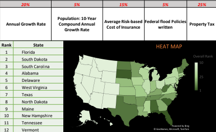
  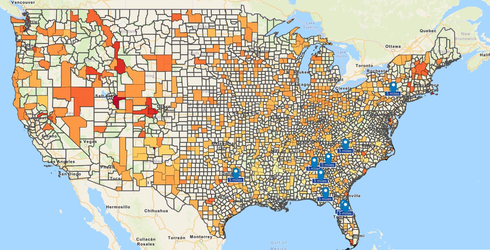
  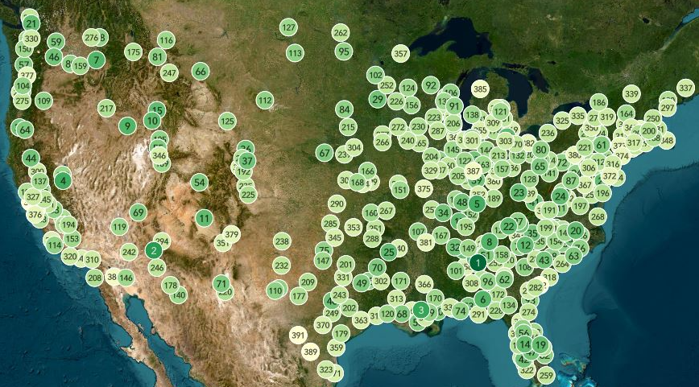
  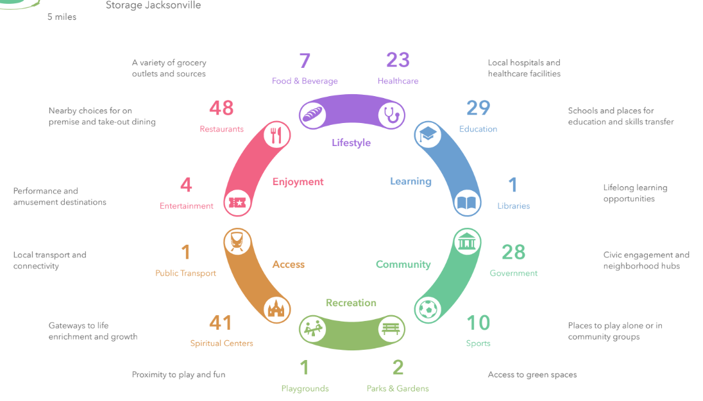
  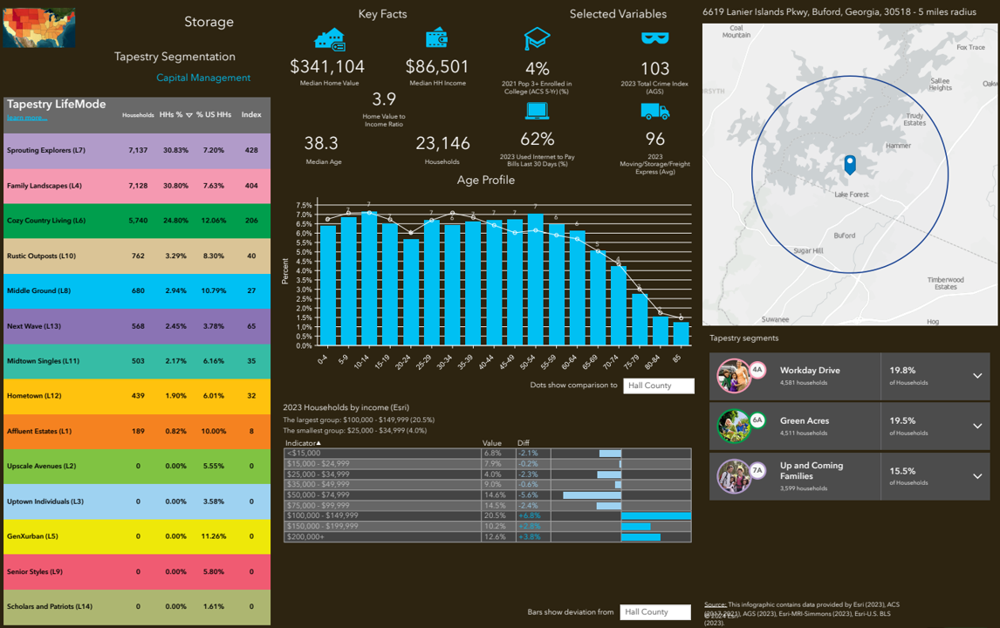
  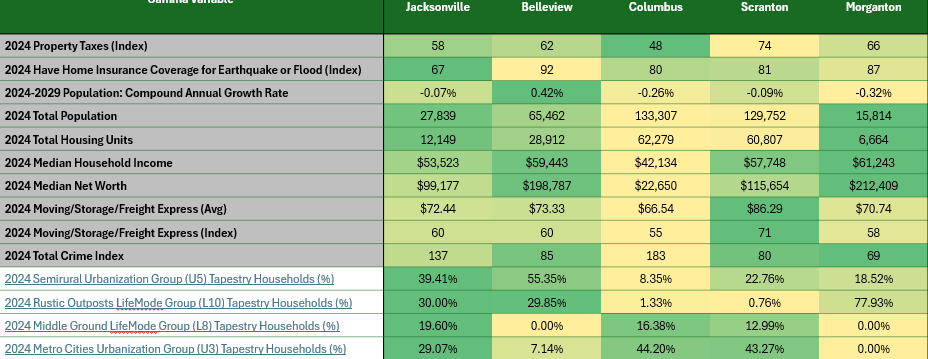
  

 
### **Innovation Unit Supervisor** | Broward County Government | Fort Lauderdale, FL | March 2020 – January 2022
- #### Visualizations
  

  
see examples:

  <blockquote> I used PowerBI and ArcGIS to create public-facing dashbaords and newsletters. I received recognition for supporting the community during the COVID pandemic.</blockquote>
  
  
  
  
  

### **Senior Risk Analyst** | Southeast Toyota Finance | Fort Lauderdale, FL | January 2018 – March 2020

### **Manager, Tool & Analytics** | Citrix Systems | Fort Lauderdale, FL | January 2017 – October 2017

### **Experience Insights Analytics Manager** | The Walt Disney Company | Orlando, FL | January 2014 – January 2017

### **Senior Revenue Analyst** | The Walt Disney Company | Orlando, FL | November 2011 – December 2013

### **Senior Industrial Engineer** | The Walt Disney Company | Orlando, FL | November 2008 – November 2011
- #### Visualizations
  

  
see examples:

  <blockquote> I used Advanced SAS Programming and multiple database connections (MySQL,Oracle,IBM) to create real-time operations monitoring. These efforts were spotlighted in the New York Times.</blockquote>
   
    
    
  
  
  

- #### Personalizations
  

  
see examples:

  <blockquote> I used SAS and Tableau to create personalized itineraries. I shared these methods across the company and was recognized by Disney with a technology grant.</blockquote>
  
  
  
  

### **Marketing Reporting & Analytics Manager** | The Walt Disney Company | Orlando, FL | July 2007 – November 2008

### **Senior Credit Policy Data Manager** | CitiMortgage (Citigroup) | St. Louis, MO | August 2005 – June 2007

## Certifications

    

|   |   |   |   |
|--|--|--|--|
|**Revenue Management Certificate**|Cornell University|*2012*|
|**Tableau Desktop Qualified Associate**|Tableau|*2017*|
|**SAS Certified Base Programmer**|SAS|*2005*|
|**IBM Certified Database Associate**|IBM|*2005*|
|**Microsoft Excel Expert Certification**|Microsoft|*2004*|
|**Microsoft Office Master Certification**|Microsoft|*2004*|

<!--

Show credentials:

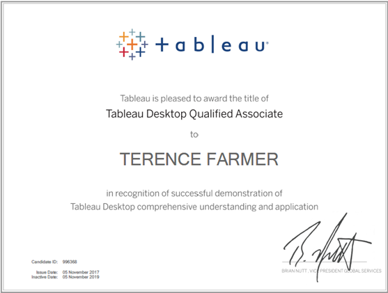

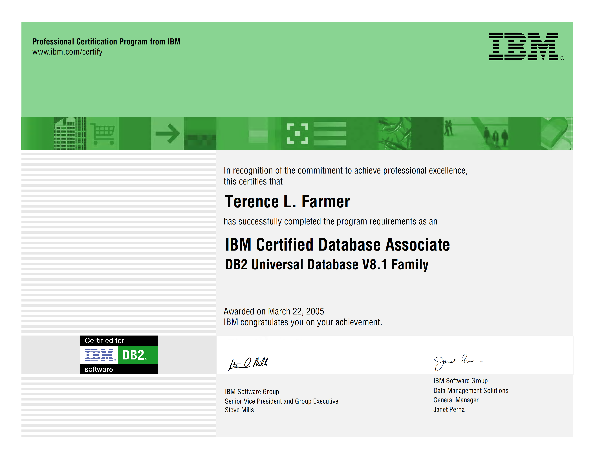

-->

## Continuing Education Units

|   |   |   |   |
|--|--|--|--|
|**Using ChatGPT and Generative AI in FinTech**|NASBA|*2026*|
|**Generative Al Fundamentals**| Databricks Academy |*2026*|
|**Project Management Foundations**| PMI Institute |*2026*|
|**Python Data Analysis**| LinkedIn Learning |*2026*| 
|**The Data Science of Economics, Banking, and Finance**|LinkedIn Learning|*2026*|
|**Databricks Fundamentals**|Databricks Academy|*2026*|
|**Microsoft Azure Fundamentals**|Microsoft|*2020*|
|**Power BI Dashboarding**|Microsoft|*2020*|
|**Credit Scorecard Development and Implementation**|SAS|*2020*|
|**Building and Solving Optimization Models**|SAS|*2018*| 
|**Survival Data Mining**|SAS| *2018*|
|**Using SAS Programs to Execute Pig and HiveQL in Hadoop**|SAS|*2018*|
|**Advanced SAS Programming Library**|SAS|*2008*|
|**Performing Advanced Queries Using PROC SQL**|SAS|*2008*|

<!--
- Using ChatGPT and Generative AI in FinTech | NASBA | 2026
- Generative Al Fundamentals | Databricks Academy | 2026
- Project Management Foundations | PMI Institute | 2026
- Python Data Analysis| LinkedIn Learning | 2026
- The Data Science of Economics, Banking, and Finance| LinkedIn Learning | 2026
- Microsoft Azure Fundamentals| Microsoft | 2020
- Power BI Dashboarding| Microsoft | 2020
- Credit Scorecard Development and Implementation | SAS | 2020
- Building and Solving Optimization Models | SAS | 2018
- Survival Data Mining | SAS | 2018
-->

more credentials:

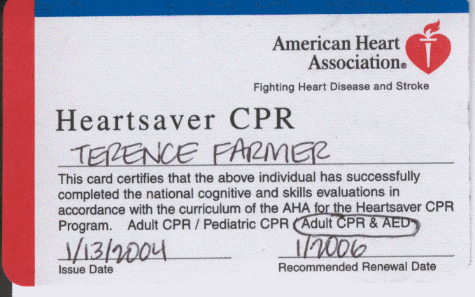

## Awards & Recognitions

## Public Speaking

<blockquote>Panelist discussing the importance of Diversity within Data & Analytics</blockquote>
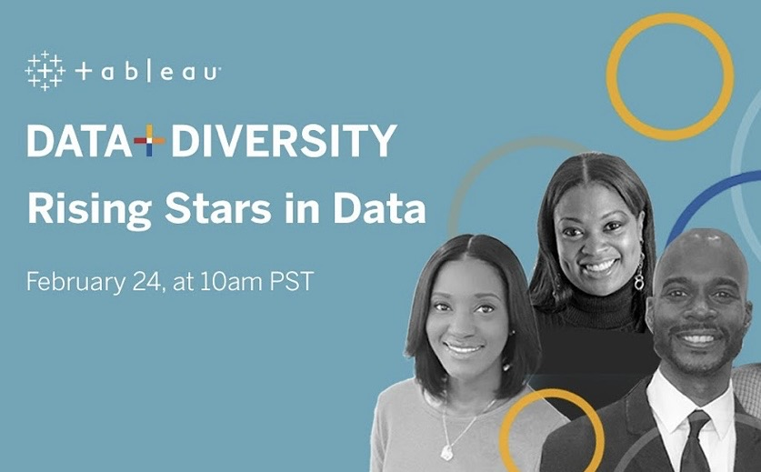

<blockquote>Panelist sharing my career journey at the intersection of Data Science, AI and Smart Cities</blockquote>
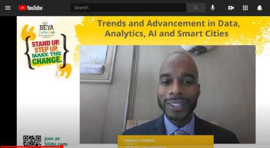

